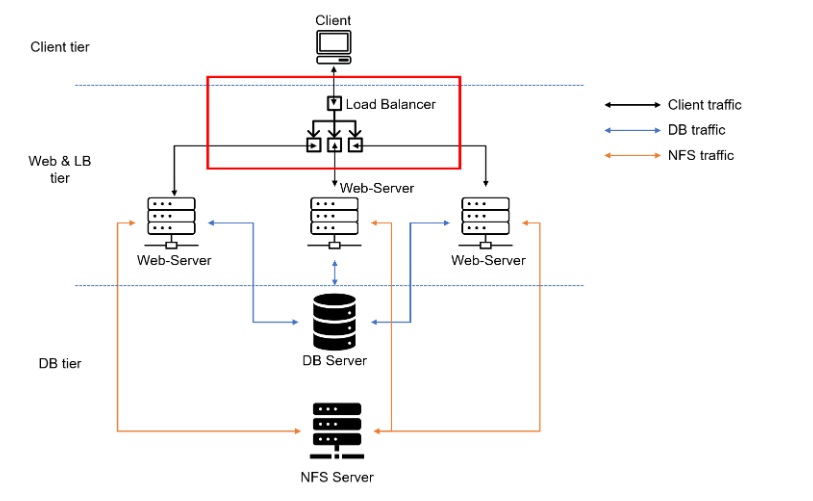
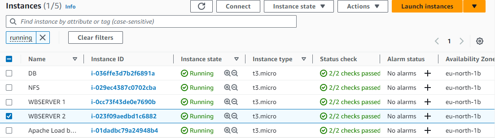

## **APACHE LOAD BALANCER**

This is a continuation of the initial project where we created 3 web servers, one DB server and one NFS server. In this project we will be adding an Apache load balancer above the webservers.

We will use the L4 Network Load balancer method https://www.nginx.com/resources/glossary/layer-4-load-balancing/ 

Below is an image of the updated solution architecture with a LB added on top of Web Servers



**Prerequisite configuration**
- Apache (httpd) process is up and running on all web servers
- '/var/www' directories of all web servers are mounted to '/mnt/apps' of NFS server
- All necessary TCP/UDP ports are open on web, DB and NFS servers
- Client browser can access all web servers by their respective Public IP addresses or Public DNS names and can open the tooling websites.

**Configure Apache As A Load Balancer**

1. Create an Ubuntu Server EC2 instance so your EC2 list will look like below.



2. Open TCP port 80 on Apache Load balancer instance by creating an inbound rule in security group
3. Install Apache load balancer on the instance and configure it to point traffic to LB to both web servers.

``````
#Install apache2
sudo apt update
sudo apt install apache2 -y
sudo apt-get install libxml2-dev

#Enable following modules:
sudo a2enmod rewrite
sudo a2enmod proxy
sudo a2enmod proxy_balancer
sudo a2enmod proxy_http
sudo a2enmod headers
sudo a2enmod lbmethod_bytraffic

#Restart apache2 service
sudo systemctl restart apache2
``````

- make sure Apache2 is up and running 

    `sudo systemctl status apache2`

- configure load balancing 

``````
sudo vi /etc/apache2/sites-available/000-default.conf

#Add this configuration into this section <VirtualHost *:80>  </VirtualHost>

<Proxy "balancer://mycluster">
               BalancerMember http://<WebServer1-Private-IP-Address>:80 loadfactor=5 timeout=1
               BalancerMember http://<WebServer2-Private-IP-Address>:80 loadfactor=5 timeout=1
               ProxySet lbmethod=bytraffic
               # ProxySet lbmethod=byrequests
        </Proxy>

        ProxyPreserveHost On
        ProxyPass / balancer://mycluster/
        ProxyPassReverse / balancer://mycluster/

#Restart apache server

sudo systemctl restart apache2
``````


4. We need to verify that our configuration works by trying to access our LB public IP address or public DNS name.

`http://<Load-Balancer-Public-IP-Address-or-Public-DNS-Name>/index.php`

**Note:** If in the Project-7 you mounted /var/log/httpd/ from your Web Servers to the NFS server – unmount them and make sure that each Web Server has its own log directory.

`sudo umount -f /var/log/httpd`

Open two ssh/Putty consoles for both Web Servers and run following command: You will see logs of accesses to the webservers through the load balancer.

`sudo tail -f /var/log/httpd/access_log`


Try to refresh your browser page http://<Load-Balancer-Public-IP-Address-or-Public-DNS-Name>/index.php several times and make sure that both servers receive HTTP GET requests from your LB – new records must appear in each server’s log file.

Optionally we can configure an internal DNS. What we can do, is to configure local domain name resolution. The easiest way is to use /etc/hosts file, although this approach is not very scalable, but it is very easy to configure and shows the concept well.

`sudo vi /etc/host`

``````
#Open this file on your LB server

sudo vi /etc/hosts

#Add 2 records into this file with Local IP address and arbitrary name for both of your Web Servers

<WebServer1-Private-IP-Address> Web1
<WebServer2-Private-IP-Address> Web2
``````

Now you can update your LB config file with those names instead of IP addresses.

`sudo vi /etc/apache2/sites-available/000-default.conf`

``````
BalancerMember http://Webserver1:80 loadfactor=5 timeout=1
BalancerMember http://Webserver2:80 loadfactor=5 timeout=1
``````

You can try to curl your Web Servers from LB locally curl http://Webserver1 or curl http://Webserver2


Testing Jenkins 2
